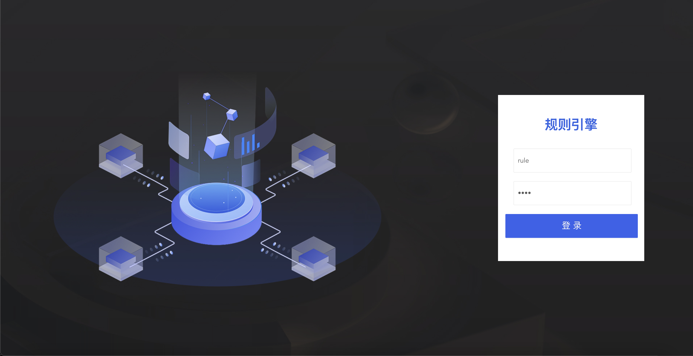
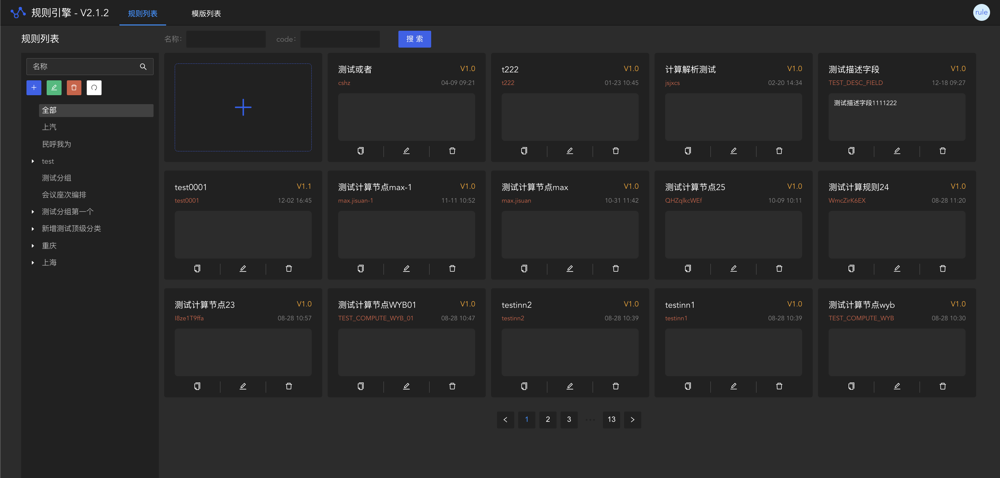
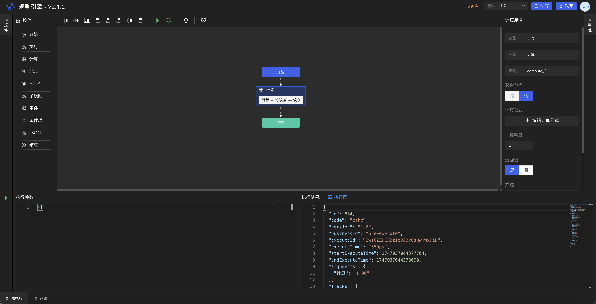

# rule-engine-design

基于 AntDesign Vue 的规则引擎设计器




# 开发环境配置

node 14.x

# 构建项目

```powershell
# 拉取项目到本地
https://github.com/yueruyin/rule-engine-design.git

# 构建
cd rule-engine-design
npm install

# 运行
npm run serve
```

# 依赖说明

> 项目名称后缀为 ant 标识，说明该项目基于 Ant Design Vue 组件库开发
> 项目名称后缀为 vant 标识，说明该项目基于 Vant 组件库开发

| 项目名             | 包名               | 说明               |
| ------------------ | ------------------ | ------------------ |
| rule-engine-design | rule-engine-design | 规则引擎设计器项目 |


# 目录结构

```
rule-engine-design
├─index.js                  对外暴露组件
├─build                     文档生成器（预留）
├─lib                       组件目录（发布到 Nexus）
│  ├─api                    组件调用API
|  ├─assets                 规则引擎静态资源目录，css等
│  ├─components             组件目录（所有组件以 “Fl” 开头，包括组件文件名和组件名称）
│  │  ├─Header              通用页头
│  │  └─ButtonWithIcon      设计器控件栏的控件按钮
│  ├─pages                  页面级组件目录（包括文件名和组件名称）
│  |  ├─RuleDesigner        设计器页面组件目录
|  |  |  ├─config           常量配置
|  |  |  ├─designer         设计器用到的组件
|  |  |  ├─img              设计器用到的图标
|  |  |  ├─js               图形化封装、组件配置等
|  |  |  └─RuleDesigner     设计器页面
│  |  └─table               首页列表页面组件目录
|  |     ├─components       设计器首页用到的组件，如分组树、分组下拉树、分组管理等
|  |     └─Table            设计器首页
|  └─utils                  规则引擎用到的工具方法目录
├─src                       测试代码目录
│  ├─assets                 静态资源目录
│  ├─mock                   模拟数据目录
│  │  ├─modules             按组件分类，不同组件的模拟数据写到不同的文件中
│  │  │  └─examples         模拟数据示例
│  │  └─index.js            MockJS配置
│  ├─router                 路由配置
├─.env.development          配置开发环境变量
├─babel.config.js           按需加载配置
├─package.json              依赖包管理
└─vue.config.js             配置相关,配置前端服务端口号，IP地址等
```

```License```
rule-engine-design is licensed under the Apache License 2.0. See the [LICENSE](License) file.
